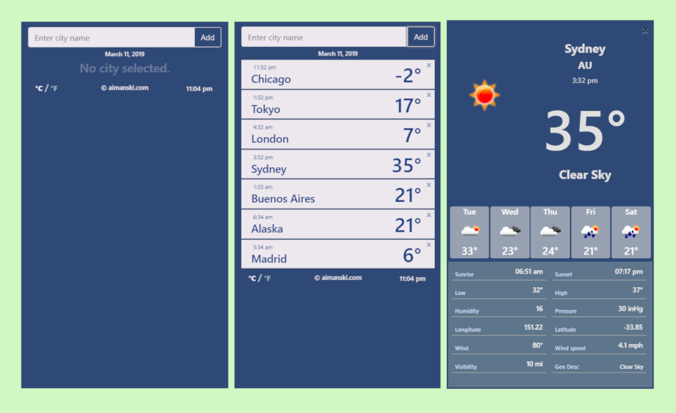

# Weather App

A Weather App built from [ReactJS](https://reactjs.org/) and deployed to [Google Firebase](https://firebase.google.com/).
All the data provided in this app are from [Open Weather Map API.](https://openweathermap.org/api)
The app is fully functional and you can use it [here.](https://aimanski-weatherapp.firebaseapp.com/)

# The PhotoBlog App looks like this

# What I Learned

* Build a full front-end web application using ReactJS.
* How to query data from an external resource and utilize data in the app using [axios](https://www.npmjs.com/package/axios).
* Use [UA-parser-js](https://www.npmjs.com/package/ua-parser-js) to calculate time of a certain city in reference to the user's current location. 
* How to deploy app to [Google Firebase](https://firebase.google.com/).
* Manipulate state changes using [Redux](https://redux.js.org/).
* Create a smooth front-end designs using [react-spring](https://www.npmjs.com/package/react-spring).

# Watch app video clip [here](https://www.youtube.com/watch?v=_M7zkeqpyD8)